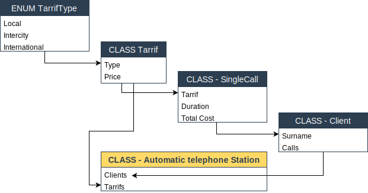

### Лабораторная работа №5:  Универсальные шаблоны (Generics)  
&nbsp;
#### Вариант 1: Предметная область — АТС.
&nbsp;  
##### Схема взаимоотношений типов:

&nbsp;  
###### Copyright ©  September, 2021