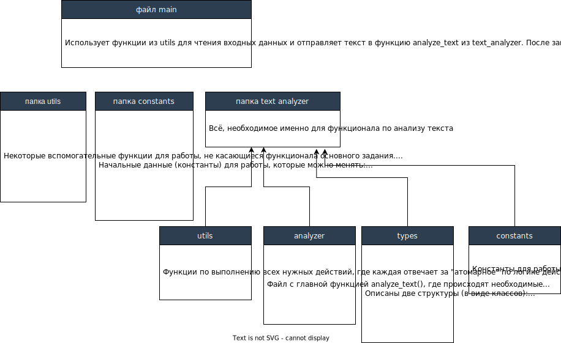

## Лабораторная работа № 1

&nbsp;    
### Структура проекта:  

### Дополнительная информация:  
Программа запускается командой `python3 main.py [ARGS]`, где `[ARGS]` - это аргументы N и K. Можно задать только параметр N, можно оба, а можно - ни одного. В файле `./data/data.py` хранятся константы по умолчанию для этих параметров и в случае отсутствия аргументов будут использованы.
Текст для анализа считывается из файла. Результаты заносятся в файл `response.txt` и выводятся дополнительно на экран.
  

### Docker: 
###### _(Для Linux)_ 
#### Создать Docker-образ с приложением:  
`sudo docker build -t <TITLE> .`

#### Запуск контейнера с приложением
`sudo docker run  --mount type=bind,source=<SOURCE>,target=/usr/src/LR1/source <TITLE> [ARGS]`, например, у меня вместо `SOURCE` == `/home/user/Documents/source` - это папка, где лежит файл, который нужно назвать `input.txt` и туда внести текст для анализа   
__! Файл для анализа должен быть таким же, какой указан в константе `SOURCE_FILE` в файле `./data/data.py` - у меня это `input.txt`__  
__! `[ARGS]` могут и не указываться. Ведь в константах файла `./data/data.py` есть значения по умолчанию__
&nbsp;  

&nbsp;  
### Основные задания:

1. _Установить Ubuntu Linux одним из способов;_
2. _Научиться пользоваться, изучить простейшие консольные команды;_
3. _Установить git, создать локальный репозиторий в git и попробовать им пользоваться;_
4. _Научиться работать с удаленным репозиторием, получая и отправляя локальные изменения;_
5. _Установить docker. Изучить простейшие консольные команды (см. лекции);_
6. _Реализация простейшего скрипта на Python_
7. _Создать docker image, который запускает скрипт из пункта 6. Данные необходимые для работы скрипта передать любым
   удобным студенту способом (например: конфиг файл через docker volume, переменные окружения, перенаправление ввода).
   Изучить простейшие консольные команды для работы с docker_

&nbsp;  

#### Задание для реализации на Python (пункт 6):
_Статистика по тексту  
На вход поступают текстовые данные.  
Необходимо
посчитать и вывести: сколько раз повторяется каждое слово в указанном тексте среднее количество слов в предложении медианное количество слов в предложении top-K самых часто повторяющихся буквенных N-грам (K и N имеют значения по-умолчанию 10 и 4, но должна быть возможность задавать их с клавиатуры).
При решении использовать контейнер dict() или его аналоги и встроенные
операции над строками. Предусмотреть обработку знаков препинания._  

&nbsp;  
###### © 2022 | BSUIR