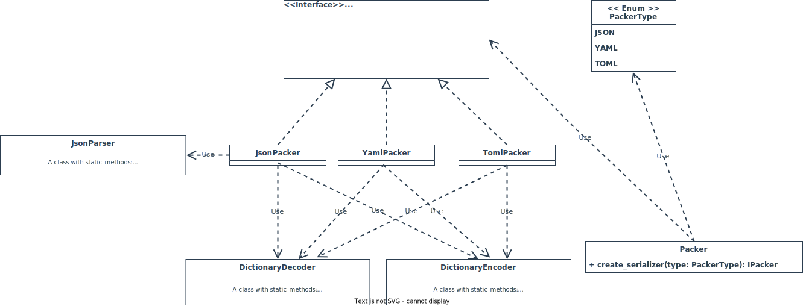

## ___Packer__ — a library for easy auto-serialization of different kinds of Python objects_

&nbsp;

### Project structure:

## Idea of my project:

#### JSON:

All kinds of objects are transformed to dictionary. Even primitives.   
Example: `var: int = 42` => `{ type: 'int', value: 42}`. Complex objects are simplified and transformed to dictionaries
of primitives. And dictionary with usual primitives can be easily serialized just with `str(dictionary)`.  
Now about decoding. I have a string with a view like: `'{ "type": "int", "value": 42}'`. I parse it with my self-made
JSON-parser and form the same dictionary as I had before serialization. Then this dictionary is computed — and I receive an object.  
&nbsp;

### To run tests:  
__[Percentage of code coverage is shown at the beginning of this Readme.md]__
1. _From `packer` (root) folder:_  
2. _Install `coverage` module: `pip install coverage`_  
3. _Run `coverage run -m unittest tests.main` command_  
4. _Generate results:_
   1. _To generate just report in console run `coverage report`_
   2. _To generate pretty HTML-report with results (coverage) run command `coverage html`_
   

___For myself I wrote a [short bash script](test.sh). It generates coverage badge for this `Readme.md` and html-report. Uses `coverage-badge` library___  
&nbsp;    

### Developed with:
* _JetBrains Pycharm_

&nbsp;   

###### © 2022 | BSUIR
