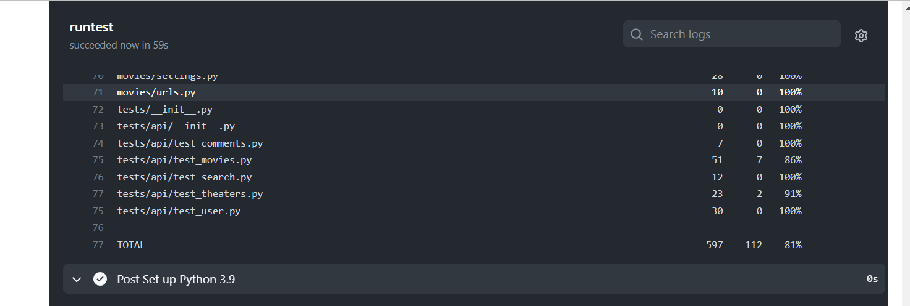

# _Movie Service [server]_  

### Deployed: [movies-service-project.surge.sh](http://movies-service-project.surge.sh/)

#### _Internal (back-end) part for my project_

##### The client part is situated in my [course-projects-repository](https://github.com/user-of-github/BSUIR_course-projects/tree/master/2%20year%20-%20Movie%20Ticket%20Sales%20Service/client)

### _Technologies stack:_

* _[Python](https://www.python.org/)_
* _[Django](https://www.djangoproject.com/)_
* _[Django Rest Framework](https://www.django-rest-framework.org/)_
* _[PostgreSQL](https://www.postgresql.org/)_
* _[PyTest](https://pytest-cov.readthedocs.io/en/latest/readme.html)_
* _[Docker](https://www.docker.com/)_  
* _[GitHub Actions](https://github.com/features/actions)_  
* _[Heroku](https://www.heroku.com)_  

### _Developed in:_
* _JetBrains PyCharm_
* _PostMan_  
* _Heroku Dashboard_  
* _Docker Desktop_

### _To run tests:_

`coverage run -m pytest`  
`coverage html`

### To generate SVG badge:

`coverage-badge -o coverage.svg`

### To deploy client (from its repo): 
Set `PRODUCTION` variable to `true` in `configuration.ts`  
`yarn`  
`yarn build`  
`cd build`  
`surge`  (url: `movies-service-project.surge.sh`)  

### To deploy server (strange approach, but I found only it):  
1. _Copy `movies` folder to folder for deploy_  
2. _Change in `configuration.json`  `PRODUCTION` to `true`_ 
3. _Create superuser via heroku-console_
4. _Push it to special separate repo for deploy_ 
5. _Run Deploy from Heroku DashBoard, if necessary_  
&nbsp;  

### To work with docker (run server locally, DEBUG):  
0. __DON'T FORGET TO MAKE SETTINGS !! ))__
1. From `movies` folder  
2. `docker-compose build` 
3. `docker-compose up -d`  
4. `docker-compose exec web python manage.py migrate --noinput`

__`<to check>`__
4. `docker-compose exec db psql --username=django_user --dbname=django_db` 
   1. `\l`
   2. `\dt`  

__`</to check>`__
5. Here you can open browser and check api 
6. `docker-compose run django python manage.py createsuperuser`

#### Some demos:  
  

&nbsp;  

###### © 2022 | All Rights Reserved
